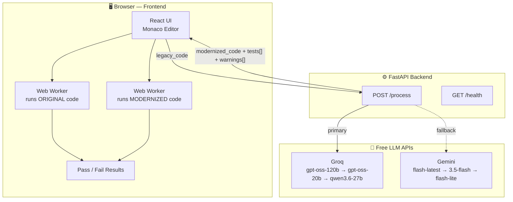
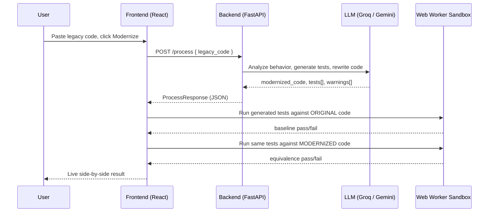

<h1 align="center">LegacyProof</h1>

<p align="center">
  
  
</p>

<p align="center">
  <strong>AI-powered legacy code modernizer that doesn't just rewrite your code — it proves the rewrite is safe.</strong>
</p>

<p align="center">
  Paste legacy JavaScript/jQuery code in, get a modernized TypeScript rewrite out — along with a test suite generated directly from the original code's real behavior, run live against both versions. Not "probably fine." Proven.
</p>

<p align="center">Built for <strong>BuildSprint by LatentForce.ai</strong>.</p>

> This hackathon build proves the core pattern — behavior-based equivalence verification — at the level of a single function. The same approach scales directly to verifying full-codebase migrations, which is the real problem engineering teams actually face when modernizing legacy systems.

---

## How it works



No database, no deployment required for the demo — everything runs locally, and equivalence checking happens entirely client-side in sandboxed Web Workers, not on the backend. See [`TECH_STACK.md`](./TECH_STACK.md) for the full breakdown of why (and how it stays 100% free).

### Request lifecycle



The key design point: **verification happens independently of the AI.** The LLM only generates code and tests — whether the rewrite actually passes those tests is decided by real, deterministic execution in the browser, not by asking the model if it thinks the rewrite is correct.

---

## Project Docs

| Doc | What's in it |
|---|---|
| [`PRD.md`](./PRD.md) | What this is, who it's for, feature scope, judging-criteria alignment |
| [`TECH_STACK.md`](./TECH_STACK.md) | Full stack breakdown — every tool used, and why it's free |
| [`contract.md`](./contract.md) | The exact frontend/backend API contract, with a live change log |
| [`.latentcode/skills/legacy-equivalence-test-generator/SKILL.md`](./.latentcode/skills/legacy-equivalence-test-generator/SKILL.md) | The published SkillPatch skill powering the core test-generation logic |

---

## Prerequisites

- **Node.js** 18+ and npm
- **Python** 3.10+
- At least one free API key:
  - Groq (primary) — [console.groq.com](https://console.groq.com), no card required
  - Gemini (fallback) — [Google AI Studio](https://aistudio.google.com), no card required

---

## Setup (from a clean clone)

### 1. Clone and enter the project

```bash
git clone https://github.com/dnvLikhitha/LegacyProof
cd LegacyProof-main
```

### 2. Backend

```bash
cd backend
python3 -m venv venv
source venv/bin/activate        # Windows: venv\Scripts\activate
pip install -r requirements.txt
cp .env.example .env
```

Edit `.env` with at least one real key:

```
GROQ_API_KEY=your_actual_groq_key_here
GEMINI_API_KEY=your_actual_gemini_key_here
PORT=8000
HOST=0.0.0.0
```

Run it:

```bash
python run.py
```

Confirm it's alive:

```bash
curl http://localhost:8000/health
# {"status":"ok"}
```

### 3. Frontend

New terminal, backend still running:

```bash
cd frontend
npm install
cp .env.example .env      # already points at localhost:8000, no edits needed
npm run dev
```

Open the URL Vite prints — typically `http://localhost:5173`.

---

## Verifying everything works

1. Load one of the built-in sample snippets (currency formatter, cart summary, or slug sanitizer).
2. Click **Modernize**.
3. Watch: modernized TypeScript appears, tests generate, then run live against both the original and modernized code — pass/fail shown on screen.

If step 3 errors out immediately, check that `backend/.env` has a real key (not the placeholder) and that you restarted `python run.py` after editing it.

---

## Running the tests

**Backend** (from `backend/`, venv activated):

```bash
pytest test_main.py -v
```

`test_health_check`, `test_process_empty_code`, and `test_process_with_mocked_llm` always pass — no API keys needed. `test_process_simple_function`, `test_process_string_formatter`, and `test_process_jquery_dom_snippet` call the real LLM and need valid keys in `.env`; without them they fail cleanly with a clear error, not a crash.

**Frontend** (from `frontend/`):

```bash
npm run test
```

---

## Project Structure

```
LegacyProof-main/
├── PRD.md
├── TECH_STACK.md
├── contract.md
├── .latentcode/
│   └── skills/
│       └── legacy-equivalence-test-generator/
│           └── SKILL.md
├── backend/
│   ├── main.py           # FastAPI app — /health and /process
│   ├── models.py         # Pydantic request/response models
│   ├── llm_service.py    # LLM prompt + Groq/Gemini calls
│   ├── run.py            # Entry point (uvicorn)
│   ├── test_main.py
│   ├── requirements.txt
│   └── .env.example
└── frontend/
    ├── src/
    │   ├── App.tsx
    │   ├── api.ts         # Calls backend /process
    │   ├── runner.ts      # Web Worker sandbox + equivalence checking
    │   ├── runner.test.ts
    │   ├── samples.ts      # Built-in demo snippets
    │   ├── types.ts        # Shared types (matches contract.md)
    │   └── components/
    │       └── TestResultsPanel.tsx
    ├── package.json
    └── .env.example
```

---

## Notes

- Local-only demo build — not deployed. Run both servers locally as described above.
- Scope is intentionally limited to single JavaScript/jQuery functions (see `PRD.md` for the full reasoning) — this is what keeps the stack free and the sandbox execution safe and simple.
- `GLM-5.2` and `Gemini 3.7 Flash` (available via LatentCode) were used to *build* this project, not called by the app at runtime — the app's own live LLM calls go to Groq/Gemini directly, as documented in `TECH_STACK.md`.

---

<p align="center">Built with 🧡 using LatentCode · BuildSprint 2026</p>
